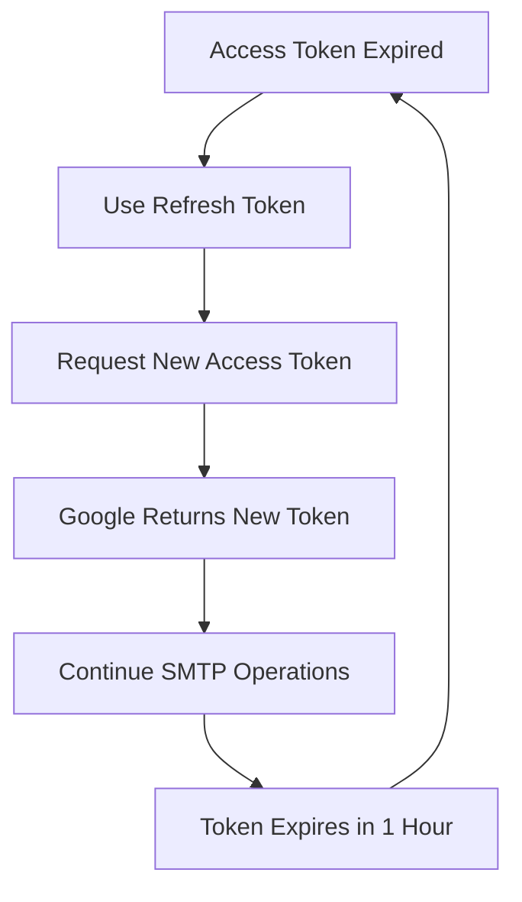

# Gmail OAuth2 Setup Guide

## Overview

This guide covers setting up OAuth2 authentication for Gmail and Google Workspace with ssmtp-mailer. Since Google has phased out App Passwords for many accounts, OAuth2 is now the recommended authentication method.

## 🔐 Authentication Methods

| Method | Use Case | Security | Automation | Setup Complexity |
|--------|----------|----------|------------|------------------|
| **App Passwords** | Legacy systems | Medium | ✅ Yes | Low |
| **OAuth2 User** | Personal accounts, dev | High | ⚠️ Manual refresh | Medium |
| **Service Account** | Production servers | Highest | ✅ Fully automated | High |

## 🚀 Quick Start

### Prerequisites
- Python 3.6+ installed
- OAuth2 Client ID from Google Cloud Console
- OAuth2 Client Secret from Google Cloud Console
- Gmail account with 2FA enabled

### 1. Use the Helper Tool
```bash
# Launch Gmail OAuth2 helper
python3 tools/oauth2-helper/oauth2-helper.py gmail

# Or run directly
python3 tools/oauth2-helper/python/gmail-oauth2-helper.py
```

### 2. Follow the Prompts
1. Enter your OAuth2 Client ID
2. Enter your OAuth2 Client Secret
3. Open the authorization URL in your browser
4. Sign in and grant permissions
5. Tokens will be saved to `oauth2_tokens.json`

## 📋 Detailed Setup

### Step 1: Google Cloud Console Setup

#### 1.1 Create/Select Project
1. Go to [Google Cloud Console](https://console.cloud.google.com/)
2. Create a new project or select existing one
3. Note your **Project ID** for later use

#### 1.2 Enable Gmail API
1. **APIs & Services** → **Library**
2. Search for "Gmail API"
3. Click **Enable**
4. Wait for API to be enabled

#### 1.3 Configure OAuth Consent Screen
1. **APIs & Services** → **OAuth consent screen**
2. Choose **External** user type
3. Fill in required information:
   - **App name**: Your mail relay app name
   - **User support email**: Your email
   - **Developer contact information**: Your email
4. Click **Save and Continue**
5. **Scopes**: Add `https://mail.google.com/` scope
6. **Test users**: Add your Gmail address
7. Click **Save and Continue**

#### 1.4 Create OAuth2 Credentials
1. **APIs & Services** → **Credentials**
2. Click **Create Credentials** → **OAuth 2.0 Client IDs**
3. Choose **Web application**
4. Fill in details:
   - **Name**: Your app name
   - **Authorized redirect URIs**:
     - `http://localhost:8080/oauth2callback` (for testing)
     - `https://yourdomain.com/oauth2callback` (for production)
5. Click **Create**
6. **Save both Client ID and Client Secret**

### Step 2: OAuth2 Authentication Flow

#### 2.1 Start Authentication
1. **Enter your credentials**:
   - Client ID (from Google Cloud Console)
   - Client Secret (from Google Cloud Console)
   - Redirect URI (must match what you configured)

2. **Click "Start OAuth2"**

#### 2.2 Google Authorization
1. **Browser opens** to Google's consent screen
2. **Sign in** with your Gmail account
3. **Review permissions**:
   - Access to Gmail
   - Send emails on your behalf
4. **Click "Allow"**

#### 2.3 Token Exchange
1. **Authorization code** is sent back to your helper
2. **Helper exchanges code** for tokens
3. **Tokens received**:
   - `access_token` (valid for 1 hour)
   - `refresh_token` (long-lived, for renewing access)
   - `expires_in` (seconds until access token expires)

### Step 3: Using Tokens in ssmtp-mailer

#### 3.1 Configuration
```json
{
  "smtp": {
    "host": "smtp.gmail.com",
    "port": 587,
    "security": "tls",
    "auth": {
      "type": "oauth2",
      "client_id": "your-client-id.apps.googleusercontent.com",
      "client_secret": "your-client-secret",
      "refresh_token": "your-refresh-token",
      "user": "your-email@gmail.com"
    }
  }
}
```

#### 3.2 Token Refresh Process


## 🔧 Service Account Authentication (Advanced)

**Best for**: Production servers, multi-user setups, domain-wide delegation

### Prerequisites
- Google Cloud Project with Gmail API enabled
- Google Workspace Admin access (for domain-wide delegation)
- Service account JSON key file
- Domain verification completed

### Setup Steps

#### 1. Create Service Account
1. Go to [Google Cloud Console](https://console.cloud.google.com/)
2. Select your project
3. **APIs & Services** → **Credentials**
4. **Create Credentials** → **Service Account**
5. Fill in details:
   - **Name**: `mail-relay-service`
   - **Description**: `Service account for mail relay system`
6. Click **Create and Continue**
7. **Skip role assignment** → **Continue**
8. Click **Done**

#### 2. Create and Download Private Key
1. **Click on your service account** (mail-relay-service)
2. **Keys tab** → **Add Key** → **Create new key**
3. **Choose JSON format**
4. **Download the JSON file** (keep this secure!)
5. **Note the `client_email`** from the JSON file

#### 3. Enable Domain-Wide Delegation
1. **In your service account**, click **Details**
2. **Show domain-wide delegation** → **Enable**
3. **Copy the Client ID** (you'll need this)

#### 4. Google Workspace Admin Configuration
1. **Go to [Google Admin Console](https://admin.google.com/)**
2. **Security** → **Access and data control** → **API controls**
3. **Manage Domain Wide Delegation**
4. **Add new**:
   - **Client ID**: Paste your service account client ID
   - **OAuth Scopes**: `https://mail.google.com/`

#### 5. Configuration
```ini
[domain:domain1.com]
enabled = true
smtp_server = smtp.gmail.com
smtp_port = 587
auth_method = SERVICE_ACCOUNT
service_account_file = /path/to/service-account.json
service_account_user = mail-relay@domain1.com
use_ssl = false
use_starttls = true
```

## 🔒 Security Considerations

### Client Secret Security
- **Never expose** client secret in client-side code
- **Use environment variables** or secure configuration
- **Rotate secrets** if compromised
- **Limit redirect URIs** to your domains only

### Token Security
- **Refresh tokens** are long-lived - keep secure
- **Access tokens** expire quickly - less critical
- **Use HTTPS** for all OAuth2 communications
- **Validate state parameter** to prevent CSRF

### Service Account Security
- **Keep JSON key files secure** (600 permissions)
- **Use environment variables** for file paths
- **Rotate keys periodically**
- **Monitor service account usage**
- **Limit scopes** to only what's needed

## 🧪 Testing Your Setup

### 1. Verify Tokens
```bash
# Test OAuth2 access token
curl -H "Authorization: Bearer YOUR_ACCESS_TOKEN" \
     "https://gmail.googleapis.com/gmail/v1/users/me/profile"

# Test service account (if using JWT)
curl -H "Authorization: Bearer YOUR_JWT_TOKEN" \
     "https://gmail.googleapis.com/gmail/v1/users/me/profile"
```

### 2. Test SMTP Connection
```bash
# Test with openssl
openssl s_client -connect smtp.gmail.com:587 -starttls smtp

# Test with your mailer application
ssmtp-mailer test
```

### 3. Monitor Usage
- **Google Cloud Console** → **APIs & Services** → **Dashboard**
- **Quotas and limits** for Gmail API
- **Error rates** and response times

## 🆘 Troubleshooting

### Common OAuth2 Errors

#### "redirect_uri_mismatch"
- **Cause**: Redirect URI doesn't match Google Cloud Console
- **Fix**: Update redirect URIs in OAuth2 credentials

#### "invalid_client"
- **Cause**: Client ID or secret is incorrect
- **Fix**: Verify credentials from Google Cloud Console

#### "access_denied"
- **Cause**: User denied permission or consent screen not configured
- **Fix**: Check OAuth consent screen and test users

#### "invalid_grant"
- **Cause**: Authorization code expired or already used
- **Fix**: Start new OAuth2 flow

### Common Service Account Errors

#### "invalid_grant"
- **Cause**: Domain-wide delegation not configured
- **Fix**: Configure in Google Workspace Admin

#### "unauthorized_client"
- **Cause**: Service account not enabled for Gmail API
- **Fix**: Enable Gmail API in Google Cloud Console

#### "invalid_scope"
- **Cause**: Incorrect OAuth scope configured
- **Fix**: Use `https://mail.google.com/` scope

### Debug Steps
1. **Check browser console** for JavaScript errors
2. **Verify network requests** in Developer Tools
3. **Check Google Cloud Console** logs
4. **Ensure Gmail API is enabled**
5. **Verify redirect URI matches exactly**
6. **Check service account permissions**
7. **Verify domain-wide delegation**

## 📚 Best Practices

### Development
- **Use localhost** for testing
- **Test with personal account** first
- **Keep credentials** in separate config files
- **Use environment variables** for secrets

### Production
- **Verify domain ownership**
- **Use HTTPS redirect URIs**
- **Implement proper error handling**
- **Monitor token refresh failures**
- **Set up alerts** for authentication issues

### Maintenance
- **Regular security reviews**
- **Monitor API usage**
- **Update OAuth2 consent screen** as needed
- **Rotate client secrets** periodically
- **Update service account keys** regularly

## 🔗 Additional Resources

### Official Documentation
- [Google OAuth2 Documentation](https://developers.google.com/identity/protocols/oauth2)
- [Gmail API Documentation](https://developers.google.com/gmail/api)
- [Google Cloud Console Help](https://cloud.google.com/apis/docs/overview)
- [Service Account Documentation](https://cloud.google.com/iam/docs/service-accounts)

### Community Resources
- [Stack Overflow](https://stackoverflow.com/questions/tagged/oauth2+google)
- [Google Cloud Community](https://cloud.google.com/community)
- [GitHub Issues](https://github.com/blburns/ssmtp-mailer/issues)

## 📋 Summary

**OAuth2 User Authentication** is great for development and personal use, while **Service Account Authentication** is ideal for production servers and enterprise environments.

Both methods provide secure, modern authentication that replaces the deprecated App Passwords. Choose the method that best fits your use case and security requirements! 🚀

**Remember**: Keep your credentials secure and monitor your authentication systems regularly.

---

*For help with other email providers, see our [OAuth2 documentation index](README.md).*
