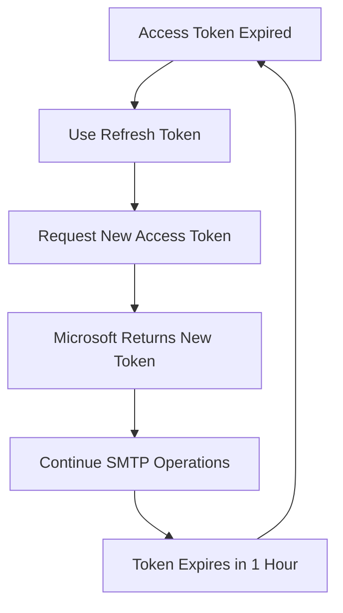

# Office 365 OAuth2 Setup Guide

## Overview

This guide covers setting up OAuth2 authentication for Office 365 and Microsoft 365 with ssmtp-mailer. Microsoft's modern authentication system uses OAuth2 for secure, token-based access to email services.

## 🔐 Authentication Methods

| Method | Use Case | Security | Automation | Setup Complexity |
|--------|----------|----------|------------|------------------|
| **Basic Auth** | Legacy systems | Low | ✅ Yes | Low |
| **OAuth2 User** | Personal accounts, dev | High | ⚠️ Manual refresh | Medium |
| **Service Principal** | Production servers | Highest | ✅ Fully automated | High |

## 🚀 Quick Start

### Prerequisites
- Python 3.6+ installed
- OAuth2 Client ID from Azure Portal
- OAuth2 Client Secret from Azure Portal
- Tenant ID from Azure Portal
- Office 365 account

### 1. Use the Helper Tool
```bash
# Launch Office 365 OAuth2 helper
python3 tools/oauth2-helper/oauth2-helper.py office365

# Or run directly
python3 tools/oauth2-helper/python/office365-oauth2-helper.py
```

### 2. Follow the Prompts
1. Enter your OAuth2 Client ID
2. Enter your OAuth2 Client Secret
3. Enter your Tenant ID
4. Open the authorization URL in your browser
5. Sign in and grant permissions
6. Tokens will be saved to `office365_oauth2_tokens.json`

## 📋 Detailed Setup

### Step 1: Azure Portal Setup

#### 1.1 Create/Select App Registration
1. Go to [Azure Portal](https://portal.azure.com/)
2. Navigate to **Azure Active Directory** → **App registrations**
3. Click **New registration**
4. Fill in details:
   - **Name**: Your mail relay app name
   - **Supported account types**: Choose based on your needs
   - **Redirect URI**: `http://localhost:8080` (for testing)
5. Click **Register**

#### 1.2 Configure Authentication
1. **Authentication** → **Add a platform**
2. Choose **Web**
3. Add redirect URIs:
   - `http://localhost:8080` (for testing)
   - `https://yourdomain.com/oauth2callback` (for production)
4. **Implicit grant and hybrid flows**: Check **Access tokens** and **ID tokens**
5. Click **Configure**

#### 1.3 Configure API Permissions
1. **API permissions** → **Add a permission**
2. Choose **Microsoft Graph**
3. Select **Delegated permissions**
4. Add these permissions:
   - `Mail.Send` - Send mail as a user
   - `Mail.ReadWrite` - Read and write mail
   - `User.Read` - Sign in and read user profile
5. Click **Add permissions**
6. **Grant admin consent** for your organization

#### 1.4 Create Client Secret
1. **Certificates & secrets** → **New client secret**
2. Add description and choose expiration
3. **Copy the secret value** (you won't see it again!)
4. Note your **Application (client) ID** and **Directory (tenant) ID**

### Step 2: OAuth2 Authentication Flow

#### 2.1 Start Authentication
1. **Enter your credentials**:
   - Client ID (from Azure Portal)
   - Client Secret (from Azure Portal)
   - Tenant ID (from Azure Portal)
   - Redirect URI (must match what you configured)

2. **Click "Start OAuth2"**

#### 2.2 Microsoft Authorization
1. **Browser opens** to Microsoft's consent screen
2. **Sign in** with your Office 365 account
3. **Review permissions**:
   - Send emails on your behalf
   - Read and write mail
   - Access your profile
4. **Click "Accept"**

#### 2.3 Token Exchange
1. **Authorization code** is sent back to your helper
2. **Helper exchanges code** for tokens
3. **Tokens received**:
   - `access_token` (valid for 1 hour)
   - `refresh_token` (long-lived, for renewing access)
   - `expires_in` (seconds until access token expires)

### Step 3: Using Tokens in ssmtp-mailer

#### 3.1 Configuration
```json
{
  "smtp": {
    "host": "smtp.office365.com",
    "port": 587,
    "security": "tls",
    "auth": {
      "type": "oauth2",
      "client_id": "your-client-id",
      "client_secret": "your-client-secret",
      "refresh_token": "your-refresh-token",
      "user": "your-email@domain.com",
      "tenant_id": "your-tenant-id"
    }
  }
}
```

#### 3.2 Token Refresh Process


## 🔧 Service Principal Authentication (Advanced)

**Best for**: Production servers, multi-tenant applications, automated systems

### Prerequisites
- Azure subscription with Azure AD
- Global Administrator or Application Administrator access
- Service principal with appropriate permissions
- Domain verification completed

### Setup Steps

#### 1. Create Service Principal
1. **Azure Portal** → **Azure Active Directory** → **App registrations**
2. **New registration** with service account details
3. **API permissions** → **Microsoft Graph** → **Application permissions**
4. Add permissions:
   - `Mail.Send` - Send mail as any user
   - `Mail.ReadWrite.All` - Read and write mail in all mailboxes
5. **Grant admin consent**

#### 2. Create Client Secret
1. **Certificates & secrets** → **New client secret**
2. **Copy the secret value** and **Application ID**

#### 3. Assign Permissions
1. **Enterprise applications** → Find your app
2. **Users and groups** → **Add user/group**
3. Assign to appropriate users or groups

#### 4. Configuration
```ini
[domain:domain1.com]
enabled = true
smtp_server = smtp.office365.com
smtp_port = 587
auth_method = SERVICE_PRINCIPAL
client_id = your-service-principal-id
client_secret = your-service-principal-secret
tenant_id = your-tenant-id
use_ssl = false
use_starttls = true
```

## 🔒 Security Considerations

### Client Secret Security
- **Never expose** client secret in client-side code
- **Use environment variables** or secure configuration
- **Rotate secrets** if compromised
- **Limit redirect URIs** to your domains only

### Token Security
- **Refresh tokens** are long-lived - keep secure
- **Access tokens** expire quickly - less critical
- **Use HTTPS** for all OAuth2 communications
- **Validate state parameter** to prevent CSRF

### Service Principal Security
- **Keep credentials secure** (600 permissions for files)
- **Use environment variables** for secrets
- **Rotate credentials periodically**
- **Monitor service principal usage**
- **Limit permissions** to only what's needed

## 🧪 Testing Your Setup

### 1. Verify Tokens
```bash
# Test OAuth2 access token
curl -H "Authorization: Bearer YOUR_ACCESS_TOKEN" \
     "https://graph.microsoft.com/v1.0/me"

# Test service principal (if using)
curl -H "Authorization: Bearer YOUR_ACCESS_TOKEN" \
     "https://graph.microsoft.com/v1.0/users"
```

### 2. Test SMTP Connection
```bash
# Test with openssl
openssl s_client -connect smtp.office365.com:587 -starttls smtp

# Test with your mailer application
ssmtp-mailer test
```

### 3. Monitor Usage
- **Azure Portal** → **Azure Active Directory** → **App registrations**
- **API permissions** and consent status
- **Sign-in logs** for authentication attempts

## 🆘 Troubleshooting

### Common OAuth2 Errors

#### "AADSTS50011: The reply URL specified in the request does not match the reply URLs configured for the application"
- **Cause**: Redirect URI doesn't match Azure Portal configuration
- **Fix**: Update redirect URIs in app registration

#### "AADSTS700016: Application with identifier was not found in the directory"
- **Cause**: Client ID is incorrect or app doesn't exist
- **Fix**: Verify client ID from Azure Portal

#### "AADSTS65001: The user or administrator has not consented to use the application"
- **Cause**: Admin consent not granted for required permissions
- **Fix**: Grant admin consent in Azure Portal

#### "AADSTS50076: Due to a configuration change made by your administrator"
- **Cause**: Conditional access policies blocking access
- **Fix**: Check with your Azure administrator

### Common Service Principal Errors

#### "AADSTS50034: The user account does not exist in this directory"
- **Cause**: Service principal not assigned to users
- **Fix**: Assign service principal to appropriate users/groups

#### "AADSTS7000215: Invalid client secret is provided"
- **Cause**: Client secret is incorrect or expired
- **Fix**: Generate new client secret in Azure Portal

### Debug Steps
1. **Check Azure Portal** app registration configuration
2. **Verify API permissions** are correctly assigned
3. **Check admin consent** status
4. **Review sign-in logs** for detailed error information
5. **Ensure Microsoft Graph API** is accessible
6. **Verify tenant ID** matches your organization

## 📚 Best Practices

### Development
- **Use localhost** for testing
- **Test with personal account** first
- **Keep credentials** in separate config files
- **Use environment variables** for secrets

### Production
- **Verify domain ownership**
- **Use HTTPS redirect URIs**
- **Implement proper error handling**
- **Monitor token refresh failures**
- **Set up alerts** for authentication issues

### Maintenance
- **Regular security reviews**
- **Monitor API usage**
- **Update app registration** as needed
- **Rotate client secrets** periodically
- **Review and update permissions** regularly

## 🔗 Additional Resources

### Official Documentation
- [Microsoft Identity Platform Documentation](https://docs.microsoft.com/en-us/azure/active-directory/develop/)
- [Microsoft Graph API Documentation](https://docs.microsoft.com/en-us/graph/)
- [Azure Portal Help](https://docs.microsoft.com/en-us/azure/portal/)
- [OAuth2 Implementation Guide](https://docs.microsoft.com/en-us/azure/active-directory/develop/v2-oauth2-auth-code-flow)

### Community Resources
- [Microsoft Q&A](https://docs.microsoft.com/en-us/answers/)
- [Stack Overflow](https://stackoverflow.com/questions/tagged/azure-active-directory)
- [GitHub Issues](https://github.com/blburns/ssmtp-mailer/issues)

## 📋 Summary

**OAuth2 User Authentication** is great for development and personal use, while **Service Principal Authentication** is ideal for production servers and enterprise environments.

Both methods provide secure, modern authentication that integrates seamlessly with Microsoft's identity platform. Choose the method that best fits your use case and security requirements! 🚀

**Remember**: Keep your credentials secure and monitor your authentication systems regularly.

---

*For help with other email providers, see our [OAuth2 documentation index](README.md).*
