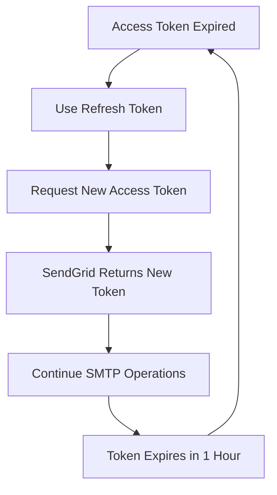

# SendGrid OAuth2 Setup Guide

## Overview

This guide covers setting up OAuth2 authentication for SendGrid with ssmtp-mailer. SendGrid is a popular email delivery service that provides reliable email infrastructure for transactional and marketing emails.

## 🔐 Authentication Methods

| Method | Use Case | Security | Automation | Setup Complexity |
|--------|----------|----------|------------|------------------|
| **API Key** | Simple integration | Medium | ✅ Yes | Low |
| **OAuth2** | Enhanced security | High | ⚠️ Manual refresh | Medium |
| **Service Account** | Enterprise use | Highest | ✅ Fully automated | High |

## 🚀 Quick Start

### Prerequisites
- Python 3.6+ installed
- SendGrid account
- OAuth2 application configured
- OAuth2 Client ID and Client Secret

### 1. Use the Helper Tool
```bash
# Launch SendGrid OAuth2 helper
python3 tools/oauth2-helper/oauth2-helper.py sendgrid

# Or run directly
python3 tools/oauth2-helper/python/sendgrid-oauth2-helper.py
```

### 2. Follow the Prompts
1. Enter your OAuth2 Client ID
2. Enter your OAuth2 Client Secret
3. Open the authorization URL in your browser
4. Sign in and grant permissions
5. Tokens will be saved to `sendgrid_oauth2_tokens.json`

## 📋 Detailed Setup

### Step 1: SendGrid Account Setup

#### 1.1 Create SendGrid Account
1. Go to [SendGrid](https://sendgrid.com/)
2. Click **Start for Free** or **Sign Up**
3. Complete account verification
4. Verify your domain (recommended for production)

#### 1.2 Enable OAuth2
1. **Settings** → **API Keys**
2. **OAuth2** tab (if available)
3. Enable OAuth2 for your account
4. Note: OAuth2 may require enterprise plan

#### 1.3 Create OAuth2 Application
1. **Settings** → **OAuth2 Applications**
2. Click **Create New Application**
3. Fill in application details:
   - **Name**: Your mail relay app name
   - **Description**: Application description
   - **Redirect URI**: `http://localhost:8080`
4. Click **Create**

#### 1.4 Get OAuth2 Credentials
1. **Copy Client ID** from your OAuth2 application
2. **Copy Client Secret** (keep this secure!)
3. Note your **SendGrid Account ID**

### Step 2: OAuth2 Authentication Flow

#### 2.1 Start Authentication
1. **Enter your credentials**:
   - Client ID (from SendGrid OAuth2 app)
   - Client Secret (from SendGrid OAuth2 app)
   - Redirect URI (must match what you configured)

2. **Click "Start OAuth2"**

#### 2.2 SendGrid Authorization
1. **Browser opens** to SendGrid's consent screen
2. **Sign in** with your SendGrid account
3. **Review permissions**:
   - Send emails on your behalf
   - Access to SendGrid API
4. **Click "Allow"**

#### 2.3 Token Exchange
1. **Authorization code** is sent back to your helper
2. **Helper exchanges code** for tokens
3. **Tokens received**:
   - `access_token` (valid for 1 hour)
   - `refresh_token` (long-lived, for renewing access)
   - `expires_in` (seconds until access token expires)

### Step 3: Using Tokens in ssmtp-mailer

#### 3.1 Configuration
```json
{
  "smtp": {
    "host": "smtp.sendgrid.net",
    "port": 587,
    "security": "tls",
    "auth": {
      "type": "oauth2",
      "client_id": "your-client-id",
      "client_secret": "your-client-secret",
      "refresh_token": "your-refresh-token",
      "user": "apikey"
    }
  }
}
```

#### 3.2 Alternative Configuration (API Key)
```json
{
  "smtp": {
    "host": "smtp.sendgrid.net",
    "port": 587,
    "security": "tls",
    "auth": {
      "type": "api_key",
      "api_key": "your-sendgrid-api-key",
      "user": "apikey"
    }
  }
}
```

#### 3.3 Token Refresh Process


## 🔧 Advanced Configuration

### Multiple Sending Domains
```json
{
  "domains": {
    "domain1.com": {
      "smtp": {
        "host": "smtp.sendgrid.net",
        "port": 587,
        "security": "tls",
        "auth": {
          "type": "oauth2",
          "client_id": "your-client-id",
          "client_secret": "your-client-secret",
          "refresh_token": "your-refresh-token",
          "user": "apikey"
        }
      }
    },
    "domain2.com": {
      "smtp": {
        "host": "smtp.sendgrid.net",
        "port": 587,
        "security": "tls",
        "auth": {
          "type": "oauth2",
          "client_id": "your-client-id-2",
          "client_secret": "your-client-secret-2",
          "refresh_token": "your-refresh-token-2",
          "user": "apikey"
        }
      }
    }
  }
}
```

### Environment Variables
```bash
# Set environment variables
export SENDGRID_CLIENT_ID="your-client-id"
export SENDGRID_CLIENT_SECRET="your-client-secret"
export SENDGRID_REFRESH_TOKEN="your-refresh-token"

# Use in configuration
{
  "smtp": {
    "host": "smtp.sendgrid.net",
    "port": 587,
    "security": "tls",
    "auth": {
      "type": "oauth2",
      "client_id": "${SENDGRID_CLIENT_ID}",
      "client_secret": "${SENDGRID_CLIENT_SECRET}",
      "refresh_token": "${SENDGRID_REFRESH_TOKEN}",
      "user": "apikey"
    }
  }
}
```

## 🔒 Security Considerations

### Client Secret Security
- **Never expose** client secret in client-side code
- **Use environment variables** or secure configuration
- **Rotate secrets** if compromised
- **Limit redirect URIs** to your domains only

### Token Security
- **Refresh tokens** are long-lived - keep secure
- **Access tokens** expire quickly - less critical
- **Use HTTPS** for all OAuth2 communications
- **Validate state parameter** to prevent CSRF

### Production Considerations
- **Domain verification** required for production
- **HTTPS redirect URIs** mandatory
- **Rate limiting** may apply
- **Audit logging** available

## 🧪 Testing Your Setup

### 1. Verify Tokens
```bash
# Test SendGrid API access
curl -H "Authorization: Bearer YOUR_ACCESS_TOKEN" \
     "https://api.sendgrid.com/v3/user/profile"

# Test email sending permissions
curl -H "Authorization: Bearer YOUR_ACCESS_TOKEN" \
     "https://api.sendgrid.com/v3/mail/settings"
```

### 2. Test SMTP Connection
```bash
# Test with openssl
openssl s_client -connect smtp.sendgrid.net:587 -starttls smtp

# Test with your mailer application
ssmtp-mailer test
```

### 3. Monitor Usage
- **SendGrid Dashboard** → **Activity** → **Email Activity**
- **API Keys** → **Usage** and **Rate Limits**
- **Settings** → **Mail Settings** → **Event Webhook**

## 🆘 Troubleshooting

### Common OAuth2 Errors

#### "redirect_uri_mismatch"
- **Cause**: Redirect URI doesn't match SendGrid configuration
- **Fix**: Update redirect URIs in SendGrid OAuth2 application

#### "invalid_client"
- **Cause**: Client ID or secret is incorrect
- **Fix**: Verify credentials from SendGrid OAuth2 application

#### "access_denied"
- **Cause**: User denied permission or consent screen not configured
- **Fix**: Check OAuth2 application configuration and user permissions

#### "invalid_grant"
- **Cause**: Authorization code expired or already used
- **Fix**: Start new OAuth2 flow

### SendGrid-Specific Issues

#### "OAuth2 not available"
- **Cause**: OAuth2 may require enterprise plan
- **Fix**: Use API key authentication instead

#### "Domain not verified"
- **Cause**: Domain verification required for production
- **Fix**: Complete domain verification in SendGrid

#### "Rate limit exceeded"
- **Cause**: API rate limits exceeded
- **Fix**: Check SendGrid rate limits and upgrade plan if needed

### Debug Steps
1. **Check SendGrid OAuth2 app** configuration
2. **Verify redirect URIs** match exactly
3. **Check API permissions** and scopes
4. **Review SendGrid logs** for authentication attempts
5. **Ensure domain verification** is complete

## 📚 Best Practices

### Development
- **Use localhost** for testing
- **Test with personal account** first
- **Keep credentials** in separate config files
- **Use environment variables** for secrets

### Production
- **Verify domain ownership**
- **Use HTTPS redirect URIs**
- **Implement proper error handling**
- **Monitor token refresh failures**
- **Set up alerts** for authentication issues

### Maintenance
- **Regular security reviews**
- **Monitor API usage**
- **Update OAuth2 application** as needed
- **Rotate client secrets** periodically
- **Review and update permissions** regularly

## 🔗 Additional Resources

### Official Documentation
- [SendGrid API Documentation](https://docs.sendgrid.com/)
- [SendGrid SMTP API](https://docs.sendgrid.com/for-developers/sending-email/getting-started-smtp)
- [SendGrid OAuth2 Guide](https://docs.sendgrid.com/for-developers/authentication/oauth2)

### Community Resources
- [SendGrid Community](https://community.sendgrid.com/)
- [Stack Overflow](https://stackoverflow.com/questions/tagged/sendgrid)
- [GitHub Issues](https://github.com/blburns/ssmtp-mailer/issues)

### Related Tools
- [SendGrid Email Testing](https://sendgrid.com/docs/ui/sending-email/test-email/)
- [SendGrid Event Webhook](https://docs.sendgrid.com/for-developers/tracking-events/event)
- [SendGrid Analytics](https://docs.sendgrid.com/ui/analytics-and-reporting/)

## 📋 Summary

SendGrid OAuth2 authentication provides:

- ✅ **Enhanced security** over API key authentication
- ✅ **Granular permissions** and scope control
- ✅ **Audit logging** and access tracking
- ✅ **Token-based authentication** with automatic refresh
- ✅ **Enterprise-grade** email delivery infrastructure

**Remember**: SendGrid OAuth2 may require enterprise plans. For basic usage, API key authentication is often sufficient and easier to implement! 🚀

---

*For help with other email providers, see our [OAuth2 documentation index](README.md).*
