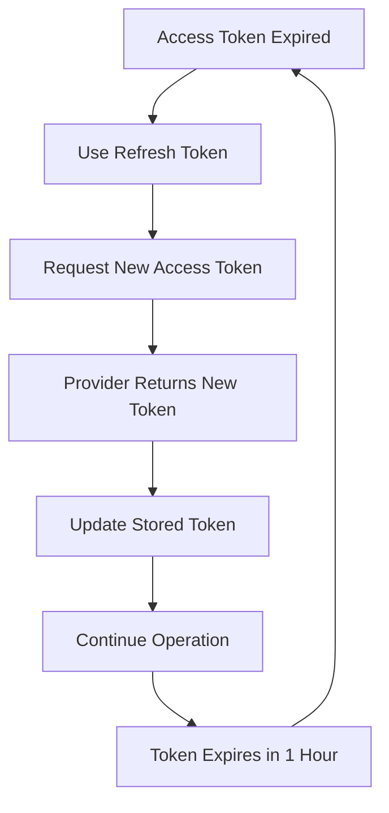
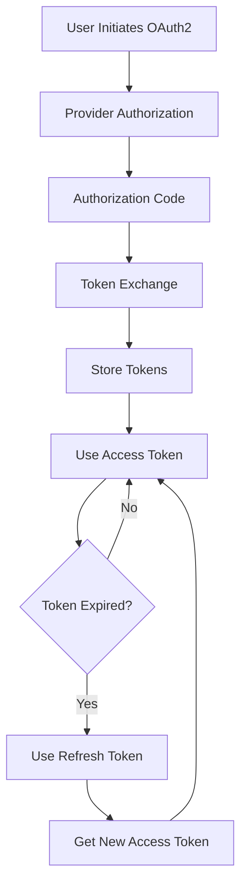

# OAuth2 Token Management Guide

## Overview

This guide covers the complete lifecycle of OAuth2 tokens in ssmtp-mailer, from generation and storage to refresh and security. Proper token management is crucial for maintaining secure, uninterrupted email operations.

## 🔑 Understanding OAuth2 Tokens

### Token Types

#### Access Token
- **Purpose**: Authenticates API requests
- **Lifetime**: Short (typically 1 hour)
- **Security**: High - provides immediate access
- **Storage**: Memory during operation, secure storage when idle

#### Refresh Token
- **Purpose**: Obtains new access tokens
- **Lifetime**: Long (can be months or years)
- **Security**: Critical - provides long-term access
- **Storage**: Secure, persistent storage

#### ID Token (JWT)
- **Purpose**: User identity information
- **Lifetime**: Short (typically 1 hour)
- **Security**: Medium - contains user info
- **Storage**: Memory only

### Token Structure
```json
{
  "access_token": "ya29.a0AfH6SMB...",
  "refresh_token": "1//04d...",
  "token_type": "Bearer",
  "expires_in": 3599,
  "scope": "https://mail.google.com/",
  "expires_at": "2024-01-15T10:30:00Z"
}
```

## 💾 Token Storage

### Local File Storage (Development)

#### Token File Locations
Each provider generates tokens in specific files:

| Provider | Token File | Location |
|----------|------------|----------|
| Gmail | `oauth2_tokens.json` | Current directory |
| Office 365 | `office365_oauth2_tokens.json` | Current directory |
| SendGrid | `sendgrid_oauth2_tokens.json` | Current directory |
| Amazon SES | `amazon_ses_oauth2_tokens.json` | Current directory |
| ProtonMail | `protonmail_oauth2_tokens.json` | Current directory |
| Zoho Mail | `zoho_mail_oauth2_tokens.json` | Current directory |
| Mailgun | `mailgun_oauth2_tokens.json` | Current directory |
| Fastmail | `fastmail_oauth2_tokens.json` | Current directory |

#### File Permissions
```bash
# Set secure permissions (600 = owner read/write only)
chmod 600 oauth2_tokens.json
chmod 600 office365_oauth2_tokens.json

# Verify permissions
ls -la *.json
```

#### File Structure
```json
{
  "access_token": "ya29.a0AfH6SMB...",
  "refresh_token": "1//04d...",
  "token_type": "Bearer",
  "expires_in": 3599,
  "scope": "https://mail.google.com/",
  "expires_at": "2024-01-15T10:30:00Z",
  "provider": "gmail",
  "user": "user@gmail.com",
  "created_at": "2024-01-15T09:30:00Z"
}
```

### Environment Variables (Production)

#### Setting Environment Variables
```bash
# Gmail
export GMAIL_CLIENT_ID="your-client-id"
export GMAIL_CLIENT_SECRET="your-client-secret"
export GMAIL_REFRESH_TOKEN="your-refresh-token"

# Office 365
export OFFICE365_CLIENT_ID="your-client-id"
export OFFICE365_CLIENT_SECRET="your-client-secret"
export OFFICE365_REFRESH_TOKEN="your-refresh-token"
export OFFICE365_TENANT_ID="your-tenant-id"

# Make persistent
echo 'export GMAIL_REFRESH_TOKEN="your-refresh-token"' >> ~/.bashrc
source ~/.bashrc
```

#### Environment File (.env)
```bash
# Create .env file
cat > .env << EOF
GMAIL_CLIENT_ID=your-client-id
GMAIL_CLIENT_SECRET=your-client-secret
GMAIL_REFRESH_TOKEN=your-refresh-token

OFFICE365_CLIENT_ID=your-client-id
OFFICE365_CLIENT_SECRET=your-client-secret
OFFICE365_REFRESH_TOKEN=your-refresh-token
OFFICE365_TENANT_ID=your-tenant-id
EOF

# Load environment variables
source .env
```

### Secure Storage Systems (Enterprise)

#### HashiCorp Vault
```bash
# Store tokens in Vault
vault kv put secret/ssmtp-mailer/gmail \
  client_id="your-client-id" \
  client_secret="your-client-secret" \
  refresh_token="your-refresh-token"

# Retrieve tokens
vault kv get secret/ssmtp-mailer/gmail
```

#### AWS Secrets Manager
```bash
# Store tokens in AWS Secrets Manager
aws secretsmanager create-secret \
  --name "ssmtp-mailer/gmail" \
  --description "Gmail OAuth2 tokens" \
  --secret-string '{
    "client_id": "your-client-id",
    "client_secret": "your-client-secret",
    "refresh_token": "your-refresh-token"
  }'

# Retrieve tokens
aws secretsmanager get-secret-value --secret-id "ssmtp-mailer/gmail"
```

#### Azure Key Vault
```bash
# Store tokens in Azure Key Vault
az keyvault secret set \
  --vault-name "your-keyvault" \
  --name "gmail-client-id" \
  --value "your-client-id"

az keyvault secret set \
  --vault-name "your-keyvault" \
  --name "gmail-refresh-token" \
  --value "your-refresh-token"
```

## 🔄 Token Refresh

### Automatic Refresh

#### How It Works
1. **ssmtp-mailer detects** access token expiration
2. **Uses refresh token** to request new access token
3. **Provider returns** new access token and optional new refresh token
4. **Operation continues** seamlessly

#### Refresh Process


### Manual Refresh

#### Using Helper Tools
```bash
# Refresh Gmail tokens
python3 tools/oauth2-helper/oauth2-helper.py gmail --refresh

# Refresh Office 365 tokens
python3 tools/oauth2-helper/oauth2-helper.py office365 --refresh
```

#### Direct API Call
```bash
# Gmail token refresh
curl -X POST "https://oauth2.googleapis.com/token" \
  -d "client_id=YOUR_CLIENT_ID" \
  -d "client_secret=YOUR_CLIENT_SECRET" \
  -d "refresh_token=YOUR_REFRESH_TOKEN" \
  -d "grant_type=refresh_token"

# Office 365 token refresh
curl -X POST "https://login.microsoftonline.com/YOUR_TENANT_ID/oauth2/v2.0/token" \
  -d "client_id=YOUR_CLIENT_ID" \
  -d "client_secret=YOUR_CLIENT_SECRET" \
  -d "refresh_token=YOUR_REFRESH_TOKEN" \
  -d "grant_type=refresh_token"
```

### Refresh Token Rotation

#### When Refresh Tokens Expire
- **Google**: Refresh tokens can expire after 6 months of inactivity
- **Microsoft**: Refresh tokens can expire based on admin policies
- **Other providers**: Varies by provider policy

#### Handling Expired Refresh Tokens
```bash
# Start new OAuth2 flow
python3 tools/oauth2-helper/oauth2-helper.py gmail

# Follow prompts to generate new tokens
# Update stored tokens in your system
```

## 🔒 Security Best Practices

### Token Storage Security

#### File Security
```bash
# Secure file permissions
chmod 600 oauth2_tokens.json
chown $USER:$USER oauth2_tokens.json

# Encrypt sensitive files
gpg -c oauth2_tokens.json
# Creates oauth2_tokens.json.gpg

# Remove unencrypted file
rm oauth2_tokens.json
```

#### Environment Security
```bash
# Don't log environment variables
set +o history
export GMAIL_REFRESH_TOKEN="your-token"
set -o history

# Clear from shell history
history -d $((HISTCMD-1))
```

#### Network Security
- **Use HTTPS** for all OAuth2 communications
- **Validate redirect URIs** to prevent token theft
- **Use state parameters** to prevent CSRF attacks
- **Implement PKCE** for public clients (if supported)

### Access Control

#### User Permissions
```bash
# Restrict file access to application user
sudo chown ssmtp-mailer:ssmtp-mailer /etc/ssmtp-mailer/oauth2/
sudo chmod 700 /etc/ssmtp-mailer/oauth2/
sudo chmod 600 /etc/ssmtp-mailer/oauth2/*.json
```

#### Application Isolation
```bash
# Run application in isolated environment
sudo systemd-run --user --unit=ssmtp-mailer \
  --setenv=GMAIL_REFRESH_TOKEN="your-token" \
  ssmtp-mailer
```

### Monitoring and Auditing

#### Token Usage Monitoring
```bash
# Monitor token refresh attempts
tail -f /var/log/ssmtp-mailer/oauth2.log

# Check token expiration
jq '.expires_at' oauth2_tokens.json | xargs -I {} date -d {} +%s
```

#### Security Auditing
```bash
# Audit file access
sudo auditctl -w /etc/ssmtp-mailer/oauth2/ -p wa -k oauth2-access

# Check for unauthorized access
ausearch -k oauth2-access
```

## 🚨 Token Security Incidents

### Compromised Tokens

#### Immediate Actions
1. **Revoke tokens** in provider console
2. **Generate new tokens** using OAuth2 flow
3. **Update all systems** with new tokens
4. **Investigate compromise** source

#### Token Revocation
```bash
# Google (via API)
curl -X POST "https://oauth2.googleapis.com/revoke" \
  -d "token=YOUR_ACCESS_TOKEN"

# Microsoft (via Azure Portal)
# Go to App registrations → Your app → Authentication → Revoke tokens
```

### Expired Tokens

#### Detection
```bash
# Check token expiration
jq -r '.expires_at' oauth2_tokens.json

# Check if token is expired
python3 -c "
import json
from datetime import datetime, timezone
with open('oauth2_tokens.json') as f:
    data = json.load(f)
    expires_at = datetime.fromisoformat(data['expires_at'].replace('Z', '+00:00'))
    now = datetime.now(timezone.utc)
    print(f'Expired: {expires_at < now}')
    print(f'Expires in: {expires_at - now}')
"
```

#### Recovery
```bash
# Start new OAuth2 flow
python3 tools/oauth2-helper/oauth2-helper.py gmail

# Update configuration files
# Restart services
sudo systemctl restart ssmtp-mailer
```

## 🔧 Configuration Management

### ssmtp-mailer Configuration

#### JSON Configuration
```json
{
  "smtp": {
    "host": "smtp.gmail.com",
    "port": 587,
    "security": "tls",
    "auth": {
      "type": "oauth2",
      "client_id": "${GMAIL_CLIENT_ID}",
      "client_secret": "${GMAIL_CLIENT_SECRET}",
      "refresh_token": "${GMAIL_REFRESH_TOKEN}",
      "user": "user@gmail.com"
    }
  }
}
```

#### Environment Variable Substitution
```bash
# Use envsubst for environment variable substitution
envsubst < config.template.json > config.json

# Or use jq for dynamic configuration
jq --arg token "$GMAIL_REFRESH_TOKEN" \
   '.smtp.auth.refresh_token = $token' \
   config.template.json > config.json
```

### Multiple Provider Configuration

#### Provider-Specific Configs
```bash
# Gmail configuration
cat > gmail.conf << EOF
[gmail]
enabled = true
smtp_server = smtp.gmail.com
smtp_port = 587
auth_method = oauth2
client_id = $GMAIL_CLIENT_ID
client_secret = $GMAIL_CLIENT_SECRET
refresh_token = $GMAIL_REFRESH_TOKEN
EOF

# Office 365 configuration
cat > office365.conf << EOF
[office365]
enabled = true
smtp_server = smtp.office365.com
smtp_port = 587
auth_method = oauth2
client_id = $OFFICE365_CLIENT_ID
client_secret = $OFFICE365_CLIENT_SECRET
refresh_token = $OFFICE365_REFRESH_TOKEN
tenant_id = $OFFICE365_TENANT_ID
EOF
```

## 📊 Token Lifecycle Management

### Token Generation Workflow


### Token Maintenance Schedule

#### Daily
- Check token expiration status
- Monitor refresh token usage
- Review authentication logs

#### Weekly
- Verify token permissions
- Check provider API status
- Review security logs

#### Monthly
- Rotate client secrets
- Update OAuth2 consent screens
- Review access patterns

#### Quarterly
- Comprehensive security review
- Update provider configurations
- Review and update scopes

## 🧪 Testing and Validation

### Token Validation

#### Verify Token Validity
```bash
# Gmail token validation
curl -H "Authorization: Bearer YOUR_ACCESS_TOKEN" \
     "https://gmail.googleapis.com/gmail/v1/users/me/profile"

# Office 365 token validation
curl -H "Authorization: Bearer YOUR_ACCESS_TOKEN" \
     "https://graph.microsoft.com/v1.0/me"
```

#### Test SMTP Authentication
```bash
# Test with ssmtp-mailer
ssmtp-mailer test --config config.json

# Test with manual SMTP
openssl s_client -connect smtp.gmail.com:587 -starttls smtp
```

### Token Refresh Testing

#### Simulate Token Expiration
```bash
# Manually expire token (for testing)
jq '.expires_at = "2024-01-01T00:00:00Z"' oauth2_tokens.json > temp.json
mv temp.json oauth2_tokens.json

# Test automatic refresh
ssmtp-mailer send --config config.json
```

## 📋 Summary

Effective OAuth2 token management requires:

1. ✅ **Secure storage** with proper permissions
2. ✅ **Automatic refresh** handling
3. ✅ **Environment isolation** for production
4. ✅ **Regular monitoring** and auditing
5. ✅ **Incident response** procedures
6. ✅ **Configuration management** best practices

**Key Principles**:
- **Access tokens** are short-lived and less critical
- **Refresh tokens** are long-lived and highly sensitive
- **Secure storage** is essential for production
- **Monitoring** helps detect issues early
- **Automation** reduces human error

**Remember**: Your refresh tokens provide long-term access to email accounts. Protect them like passwords! 🔒

---

*For specific provider setup instructions, see the individual provider guides in this documentation.*
